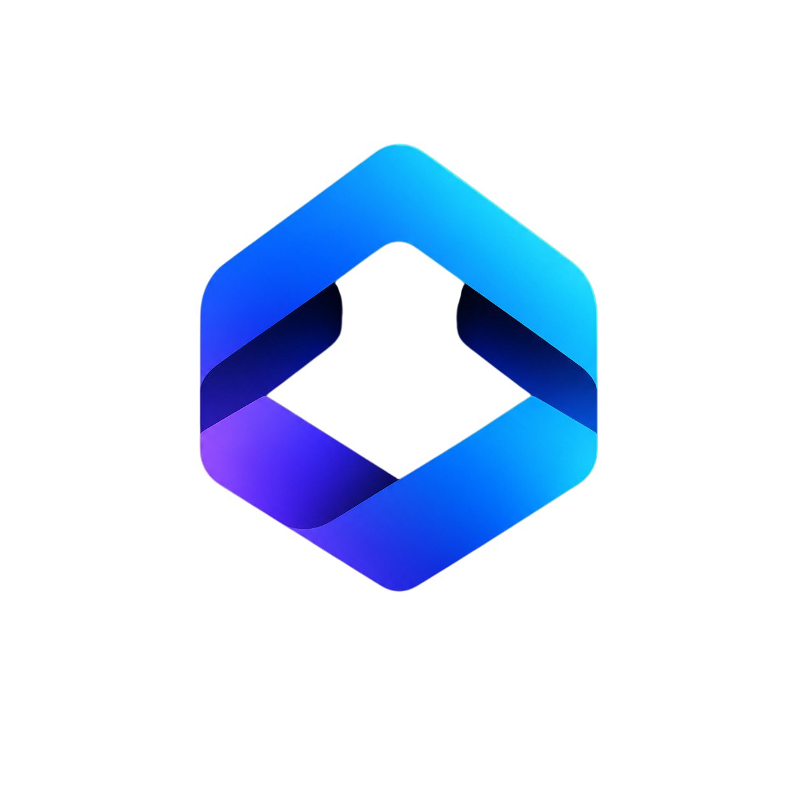
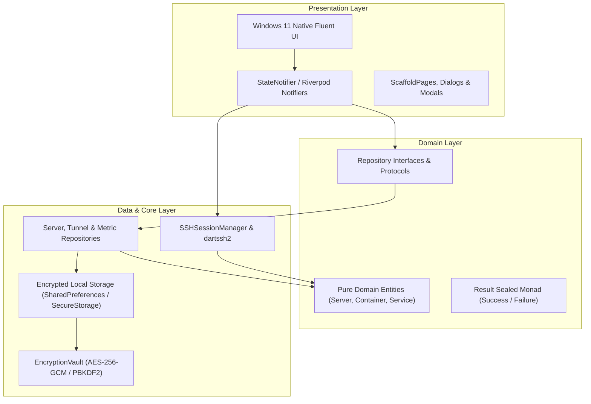

<div align="center">

<p align="center">
  
</p>

# Othrys

### *Demystifying DevOps — The Industrial-Grade Linux Infrastructure & VPS Desktop Suite*

[](https://github.com/Dali999999999/Othrys/releases)
[](https://flutter.dev)
[-0078D4?style=flat-square&logo=windows&logoColor=white)](https://fluentui.dev)
[](https://riverpod.dev)
[](#-security-architecture)
[](#-code-standards--engineering-rigor)
[-success?style=flat-square)](othrys/test)
[](LICENSE)
[-blue?style=flat-square)](#-internationalization-i18n)

<br />

**Othrys** is an open-source, industrial-grade desktop application engineered to make remote Linux infrastructure management visual, ergonomic, and reliable. Built from the ground up with **Flutter** and **Windows 11 Native Fluent UI**, Othrys eliminates the friction of managing remote cloud servers without requiring any proprietary agents on your hosts.

[Features](#-key-features) • [Architecture](#-architecture-overview) • [Installation](#-installation--getting-started) • [Security](#-security-architecture) • [Roadmap](#-roadmap) • [Contributing](CONTRIBUTING.md)

</div>

---

## 🎯 Why Othrys?

Remote server administration has traditionally forced engineering teams into an uncomfortable compromise:
1. **Raw CLI & Terminal Only**: Powerful, but mentally taxing. Juggling dozens of SSH keys, arcane `systemctl` syntax, Docker flags, and port tunnel incantations leads to human error and steep onboarding curves.
2. **Heavy Web Control Panels**: Feature-rich, but introduce massive attack vectors. They require open public web ports, root-level daemon agents on every server, and significant memory overhead.

**Othrys changes this paradigm completely.**

- 🔒 **Zero Remote Agent Architecture**: Othrys connects purely over native SSH and SFTP protocols (`RFC 4251` suite). No daemons to install, no background agents consuming RAM, and no opened attack surfaces on your remote infrastructure.
- 🎨 **Modern Desktop Ergonomics**: Experience native Windows 11 Mica / Acrylic aesthetics, smooth animations, and instantaneous keyboard-driven navigation with the Command Palette.
- 🛡️ **Zero-Trust Client Security**: All credentials, private SSH keys, and host signatures are encrypted locally with hardware-level AES-256-GCM.

---

## 🚀 Key Features

### 🖥️ Native Multi-Tab SSH Terminal
- **Hardware-Accelerated Emulation**: High-performance ANSI/VT100 terminal powered by `xterm.dart` and `dartssh2`.
- **Dynamic PTY Resize Debouncing**: Window layout adjustments cleanly recalculate terminal columns and rows without layout tearing or broken output.
- **Terminal Ergonomics**: Copy-on-select, buffer clear, keyboard shortcuts, and dynamic tab management across simultaneous server connections.

### 🐳 Docker & Container Orchestration
- **Real-Time Container Inventory**: Inspect active, stopped, and restarting containers with image tags, IDs, port bindings, and uptime counters.
- **Lifecycle Management**: Safely start, stop, restart, or delete containers with high-risk confirmation guards.
- **Live Streaming Logs**: Real-time log streaming with autoscroll, pause/resume toggles, and one-click clipboard export.
- **Docker Compose Intelligence**: Automatic detection of compose projects and service definitions.

### ⚙️ Systemd Service Orchestration
- **Service Discovery & State Tracking**: Instantly view unit states (`active`, `inactive`, `failed`).
- **Boot Enablement Control**: Query and toggle startup behavior via `systemctl list-unit-files` with one click.
- **Critical Unit Protection**: Built-in safeguards requiring double confirmation before stopping mission-critical services (such as `sshd`, `NetworkManager`, or `systemd-resolved`).
- **Journalctl Log Viewer**: Inspect recent system service logs directly from the UI to diagnose failure roots instantly.

### 📁 Interactive SFTP File Manager
- **Dual-Mode Path Navigation**: Clickable interactive breadcrumbs combined with a direct path input field for rapid folder traversal.
- **File System Explorer**: Browse remote files with permissions, file sizes, and modification timestamps.
- **Safety Rails**: Integrated 100 MB upload/download safety guard rails and native OS file picker integration.
- **File Operations**: Remote file renaming, directory creation, and safe deletion.

### 🔀 SSH Port Forwarding & Tunnels
- **Multi-Mode Tunneling**: Configure **Local** (`-L`), **Remote** (`-R`), and **Dynamic / SOCKS5** (`-D`) port forwarding in seconds.
- **Live Bandwidth Telemetry**: Active background socket piping with live counters for transmitted and received bytes.
- **Reliability Watchdog**: Background reconnection watchdog and clean socket teardown on disconnection.

### 📊 Real-Time System Monitoring
- **Visual Telemetry Gauges**: Live CPU utilization, RAM consumption, and Disk space gauges with warning and critical thresholds.
- **Historical Sparklines**: 60-second real-time CPU load trend charts powered by `fl_chart`.
- **Configurable Polling**: Dynamic background polling interval adjustable from 3 to 30 seconds.

### ⌨️ Command Palette (`Ctrl+P` / `Cmd+P`)
- **Fuzzy Search Modal**: VS Code-style global command launcher.
- **Instant Actions**: Switch servers, launch terminal tabs, open Docker logs, or toggle tunnels entirely via keyboard.
- **Full Keyboard Navigation**: Up, Down, Enter, and Esc bindings.

### 🔒 Enterprise-Grade Security
- **AES-256-GCM Encryption Vault**: All passwords and private keys stored at rest are encrypted using authenticated AES-256-GCM with PBKDF2 (100,000 iterations).
- **Strict Host Key Verification (TOFU)**: Trust-On-First-Use encrypted `known_hosts` store detecting Man-in-the-Middle (MITM) attacks and host key mutations.
- **Command Sanitizer**: Strict whitelist and parameter escaping on remote command executions.
- **Zero Silent Catches**: Swallowing exceptions is forbidden; every error is typed, logged, and surfaced appropriately.

### 🌐 Internationalization (i18n)
- **100% Bilingual Parity**: Complete English and French localization across all views, dialogs, tooltips, and system notifications.
- **Instant Runtime Switching**: Seamlessly change language on the fly without restarting the application.

---

## 🏗️ Architecture Overview

Othrys is architected in accordance with **Clean Architecture** principles and **Riverpod State Management**:



### 📐 Code Standards & Engineering Rigor
- **700-Line Ceiling Rule**: No individual Dart source file may exceed 700 lines of code. Modular composition is enforced via automated CI checks.
- **Typed Results (`Result<T>`)**: Business operations return explicit `Success<T>` or `Failure<T>` variants, preventing unchecked runtime crashes.
- **Resource Lifecycle Safety**: All background timers, SSH streams, and TCP sockets implement explicit disposal cycles to prevent memory or socket leaks.

---

## 📦 Prerequisites

To build or run Othrys from source, ensure your development environment includes:
- **Flutter SDK**: `3.22.0` or later ([Install Flutter](https://docs.flutter.dev/get-started/install))
- **Visual Studio 2022**: with the **"Desktop development with C++"** workload enabled (for Windows builds).
- **Git**: Version `2.30+`.

---

## 🛠️ Installation & Getting Started

### Option A: Pre-Compiled Windows Installer
1. Download the latest `Othrys-Setup.exe` from the [GitHub Releases](https://github.com/Dali999999999/Othrys/releases) page.
2. Run the installer and launch **Othrys** from your Start menu or Desktop shortcut.

### Option B: Building from Source

#### 1. Clone the repository
```bash
git clone https://github.com/Dali999999999/Othrys.git
cd Othrys/othrys
```

#### 2. Install dependencies
```bash
flutter pub get
```

#### 3. Run static code analysis & test suite
```bash
# Verify 0 analysis errors and warnings
flutter analyze --fatal-infos --fatal-warnings

# Execute the automated test suite (110+ tests)
flutter test
```

#### 4. Launch in development mode
```bash
flutter run -d windows
```

#### 5. Build production executable
```bash
flutter build windows --release
```
The compiled standalone executable and asset bundles will be generated in:
`build/windows/x64/runner/Release/`

---

## ⚙️ Security & Cryptographic Posture

- **Cryptographic Key Derivation**: Master keys are derived on the client machine using PBKDF2 with 100,000 iterations and a cryptographically secure random salt (CSPRNG).
- **Supported SSH Credentials**:
  - OpenSSH and PEM formats: Ed25519 (recommended), RSA, and ECDSA.
  - Passphrase-protected private keys with on-demand decryption.
- **Bastion Jump Host Routing**: Transparently proxy connections through an intermediary SSH jump box without exposing private infrastructure.

For detailed security policies and vulnerability disclosure protocols, see [SECURITY.md](SECURITY.md).

---

## 🗺️ Roadmap

### Version 0.1.0 (Current MVP Release Gate)
- [x] Multi-tab hardware-accelerated SSH terminal
- [x] Docker container inventory, controls, and streaming logs
- [x] Systemd service management and journalctl log viewer
- [x] SFTP file manager with dual breadcrumb and 100MB guards
- [x] Port forwarding tunnels (Local, Remote, Dynamic SOCKS5)
- [x] Real-time CPU, RAM, and disk utilization telemetry
- [x] Global Command Palette (`Ctrl+P` / `Cmd+P`)
- [x] AES-256-GCM Vault & TOFU host key store
- [x] 100% Bilingual localization (EN / FR)
- [x] Automated testing suite with 100% pass rate

### Version 0.2.0 (In Progress)
- [ ] macOS and Linux native desktop distributions
- [ ] Visual Nginx & Caddy reverse-proxy configuration manager
- [ ] Automated Cron job visual scheduler and runner
- [ ] Multi-server batch command execution
- [ ] Cloud backup synchronization for encrypted server profiles

---

## 🤝 Contributing

Contributions are the cornerstone of open-source software! Whether you are submitting a bug fix, proposing a new DevOps feature, or improving documentation, we warmly welcome your help.

Please read our [CONTRIBUTING.md](CONTRIBUTING.md) guide and our [CODE_OF_CONDUCT.md](CODE_OF_CONDUCT.md) before submitting pull requests.

---

## 📄 License

Distributed under the **MIT License**. See [LICENSE](LICENSE) for complete terms.

---

<div align="center">

Crafted with precision for systems engineers and DevOps practitioners worldwide.

**[⬆ Back to Top](#othrys)**

</div>
