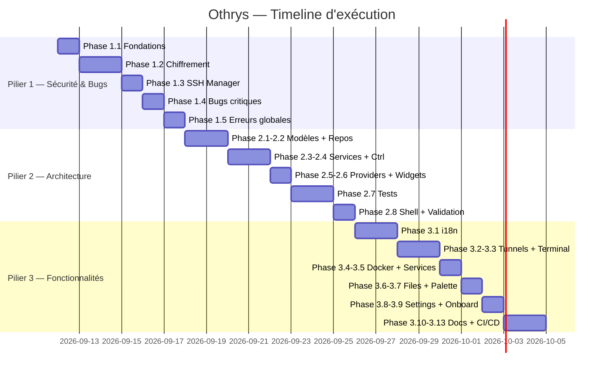

# Othrys — Protocole d'Exécution Complet

## Principes Directeurs

```
┌─────────────────────────────────────────────────────────┐
│                  BOUCLE D'EXÉCUTION                     │
│                                                         │
│   ┌──────────┐    ┌──────────┐    ┌──────────┐          │
│   │ EXÉCUTER │───▶│ VÉRIFIER │───▶│  PASSER  │          │
│   │ la tâche │    │ critères │  ✅│ suivante │          │
│   └──────────┘    └────┬─────┘    └──────────┘          │
│                        │ ❌                              │
│                   ┌────▼─────┐                          │
│                   │ CORRIGER │──── reboucle ────┐       │
│                   └──────────┘                  │       │
│                        ▲────────────────────────┘       │
│                                                         │
│   ⛔ Aucune tâche suivante sans validation OK           │
│   ⛔ Aucun fichier > 700 lignes                         │
│   ⛔ Aucun catch silencieux (catch (_) {})              │
│   ⛔ Aucun secret en clair dans le code ou sur disque   │
└─────────────────────────────────────────────────────────┘
```

### Règles Transversales (s'appliquent à CHAQUE tâche)

| Règle | Description |
|-------|-------------|
| **R1 — Fichier ≤ 700 lignes** | Tout fichier Dart > 700 lignes doit être découpé avant de passer à la tâche suivante. |
| **R2 — Cross-platform** | Le code doit compiler sur Windows, Linux, macOS. Pas de `dart:ffi` platform-specific sans `Platform` guard. |
| **R3 — Linux serveurs uniquement** | Les commandes shell ciblent Linux (systemd, apt/yum, /proc). Pas de support BSD/macOS côté serveur pour le MVP. |
| **R4 — i18n obligatoire** | Toute chaîne visible par l'utilisateur doit passer par le système d'internationalisation (`.tr()` ou ARB). |
| **R5 — Pas de catch silencieux** | Tout `catch` doit soit logger, soit remonter une erreur typée, soit afficher un retour utilisateur. |
| **R6 — Nommage cohérent** | `snake_case` pour fichiers, `PascalCase` pour classes, `camelCase` pour variables/méthodes. |
| **R7 — Documentation** | Chaque classe publique et méthode publique a un `///` doc comment. |
| **R8 — Imports relatifs** | Utiliser les imports relatifs au sein du package (`import '../core/...'`). |

### Commandes de Vérification Standards

```bash
# V1 — Compilation sans erreur
flutter analyze --no-fatal-infos

# V2 — Build réussi (Windows — machine dev)
flutter build windows --debug

# V3 — Tests unitaires passent
flutter test

# V4 — Aucun fichier > 700 lignes
find lib -name "*.dart" -exec awk 'END{if(NR>700) print FILENAME": "NR" lines"}' {} \;

# V5 — Recherche de catch silencieux
grep -rn "catch (_)" lib/ --include="*.dart"
grep -rn "catch (e) {}" lib/ --include="*.dart"
```

---

## Structure Cible du Projet

```
lib/
├── main.dart                           # Point d'entrée (≤50 lignes)
├── app/
│   ├── app.dart                        # Widget racine + navigation
│   ├── router.dart                     # Configuration des routes/navigation  
│   ├── theme/
│   │   ├── app_theme.dart              # Tokens de thème (dark + light)
│   │   └── app_typography.dart         # Échelle typographique + monospace
│   └── window/
│       └── window_titlebar.dart        # Barre de titre custom
├── core/
│   ├── models/                         # Entités de domaine
│   │   ├── server_entity.dart
│   │   ├── tunnel_entity.dart
│   │   ├── activity_log_entity.dart
│   │   ├── system_stats_entity.dart
│   │   ├── docker_container_entity.dart
│   │   ├── service_entry_entity.dart
│   │   └── file_entry_entity.dart
│   ├── enums/                          # Énumérations partagées
│   │   ├── auth_method.dart
│   │   ├── connection_state.dart
│   │   └── tunnel_type.dart
│   ├── network/
│   │   ├── ssh_session_manager.dart     # Gestion des sessions SSH
│   │   ├── active_ssh_session.dart      # Modèle de session active
│   │   └── tunnel_manager.dart          # Port forwarding SSH
│   ├── security/
│   │   ├── encryption_vault.dart        # Chiffrement AES-256-GCM
│   │   ├── host_key_store.dart          # Stockage clés hôtes SSH (TOFU)
│   │   └── command_sanitizer.dart       # Protection injection de commandes
│   ├── storage/
│   │   ├── local_storage_service.dart   # Lecture/écriture fichiers JSON
│   │   └── migration_service.dart       # Migration de schéma
│   ├── services/
│   │   ├── activity_service.dart        # Enregistrement centralisé d'activité
│   │   └── settings_service.dart        # Préférences utilisateur
│   ├── providers/
│   │   └── core_providers.dart          # Tous les providers de services
│   ├── utils/
│   │   ├── result.dart                  # Type Result<T> (Success/Failure)
│   │   ├── logger.dart                  # Logger structuré
│   │   ├── formatters.dart              # Formatage (bytes, dates, durées)
│   │   └── shell_commands.dart          # Commandes shell Linux
│   └── l10n/                            # Internationalisation
│       ├── app_localizations.dart       # Classe générée
│       ├── arb/
│       │   ├── app_en.arb               # Chaînes anglais
│       │   └── app_fr.arb               # Chaînes français
│       └── l10n.dart                    # Helper d'accès aux traductions
├── features/
│   ├── servers/
│   │   ├── server_controller.dart       # StateNotifier
│   │   ├── server_dialog.dart           # Dialog ajout/édition
│   │   └── servers_view.dart            # Vue liste
│   ├── terminal/
│   │   ├── terminal_controller.dart
│   │   └── terminal_view.dart
│   ├── file_manager/
│   │   ├── file_manager_controller.dart
│   │   └── file_manager_view.dart
│   ├── monitoring/
│   │   ├── monitoring_controller.dart
│   │   └── monitoring_view.dart
│   ├── services/
│   │   ├── services_controller.dart
│   │   └── services_view.dart
│   ├── docker/
│   │   ├── docker_controller.dart
│   │   └── docker_view.dart
│   ├── port_forwarding/
│   │   ├── tunnel_controller.dart
│   │   ├── tunnel_dialog.dart
│   │   └── tunnels_view.dart
│   ├── activity/
│   │   ├── activity_controller.dart
│   │   └── activity_feed_view.dart
│   ├── command_palette/
│   │   └── command_palette_modal.dart
│   ├── settings/
│   │   └── settings_view.dart
│   └── onboarding/
│       └── welcome_view.dart
└── shared/
    └── widgets/
        ├── connection_guard.dart         # Widget wrapper "Connectez-vous d'abord"
        ├── error_banner.dart             # Composant d'affichage d'erreur
        ├── loading_overlay.dart          # Overlay de chargement
        └── confirm_dialog.dart           # Dialog de confirmation réutilisable
```

---

# PILIER 1 — Corriger les Erreurs & Insuffisances

> **Objectif** : Sécuriser, stabiliser, rendre le code existant fiable.
> **Estimation** : 18 tâches

---

## Phase 1.1 — Fondations : Type Result et Logger

### Tâche P1-T01 : Créer le type `Result<T>`

| Champ | Valeur |
|-------|--------|
| **Fichier** | `lib/core/utils/result.dart` [NEW] |
| **Action** | Créer un sealed class `Result<T>` avec deux sous-classes : `Success<T>(T data)` et `Failure(String message, [Object? exception, StackTrace? stackTrace])` |
| **Détails** | - Méthodes : `isSuccess`, `isFailure`, `fold()`, `map()`, `getOrElse()`, `getOrThrow()` |
| **Critères d'acceptation** | ① Le fichier compile sans erreur ② ≤ 100 lignes ③ Aucune dépendance externe |
| **Vérification** | `flutter analyze` + écrire 5 assertions dans un test `test/core/utils/result_test.dart` : Success.fold, Failure.fold, map, getOrElse, getOrThrow |
| **Test** | `flutter test test/core/utils/result_test.dart` doit passer à 100% |

---

### Tâche P1-T02 : Créer le Logger structuré

| Champ | Valeur |
|-------|--------|
| **Fichier** | `lib/core/utils/logger.dart` [NEW] |
| **Action** | Créer une classe `AppLogger` avec niveaux `debug`, `info`, `warn`, `error`. En mode debug → print formaté en console. Prévoir un hook pour écriture fichier future. |
| **Détails** | - Singleton via `static final instance` - Format : `[LEVEL] [HH:mm:ss] [TAG] message` - Méthode `error()` accepte une exception et stack trace optionnelles |
| **Critères d'acceptation** | ① Compile ② ≤ 80 lignes ③ Pas d'I/O fichier pour l'instant (console uniquement) |
| **Vérification** | `flutter analyze` |
| **Test** | Pas de test unitaire requis (side-effect print). Vérification manuelle : appeler `AppLogger.instance.info('TEST', 'hello')` dans main et constater l'output. |

---

### Tâche P1-T03 : Créer les enums partagées

| Champ | Valeur |
|-------|--------|
| **Fichiers** | `lib/core/enums/auth_method.dart` [NEW], `lib/core/enums/connection_state.dart` [NEW], `lib/core/enums/tunnel_type.dart` [NEW] |
| **Action** | Extraire les enums actuellement codées en `String` : - `AuthMethod { password, privateKey }` avec `toJson()/fromJson()` - `ConnectionState { disconnected, connecting, connected, reconnecting, error }` - `TunnelType { local, remote, dynamic }` avec `toJson()/fromJson()` |
| **Critères d'acceptation** | ① Chaque fichier ≤ 30 lignes ② Compile sans erreur ③ `fromJson` a un fallback safe (orElse) |
| **Vérification** | `flutter analyze` |
| **Test** | `test/core/enums/enums_test.dart` — tester `fromJson` avec valeur valide, invalide et null-safe |

---

## Phase 1.2 — Sécurité : Chiffrement et stockage

### Tâche P1-T04 : Corriger `EncryptionVault`

| Champ | Valeur |
|-------|--------|
| **Fichier** | `lib/core/security/encryption_vault.dart` [MODIFY] |
| **Action** | ① Passer en singleton via provider Riverpod (supprimer instanciations directes) ② Ajouter `try/catch` sur `_getMasterKey` avec `Result<SecretKey>` ③ Ajouter méthode `isInitialized` ④ Supprimer tout fallback avec clé statique/hardcodée — si le secure storage échoue, remonter une `Failure` explicite ⑤ Ajouter `zeroize()` pour nettoyer `_cachedKey` |
| **Critères d'acceptation** | ① Compile ② ≤ 120 lignes ③ Aucune clé statique dans le code ④ Erreurs remontées via `Result`, jamais silencieuses |
| **Vérification** | `flutter analyze` + `grep -rn "List.generate" lib/core/security/` doit retourner 0 résultats |
| **Test** | `test/core/security/encryption_vault_test.dart` — round-trip encrypt/decrypt, données corrompues → Failure |

---

### Tâche P1-T05 : Créer `CommandSanitizer`

| Champ | Valeur |
|-------|--------|
| **Fichier** | `lib/core/security/command_sanitizer.dart` [NEW] |
| **Action** | Créer une classe utilitaire statique : - `sanitizePath(String)` : rejette `;`, `&&`, `\|\|`, `` ` ``, `$(`, et fait un shell-escape - `sanitizeIdentifier(String)` : whitelist `[a-zA-Z0-9._-]` uniquement - `buildSafeCommand(String binary, List<String> args)` : construit la commande avec chaque argument single-quoted et échappé - `isValidPort(int)` : vérifie 1-65535 - `isValidHostname(String)` : regex basique IPv4/IPv6/FQDN |
| **Critères d'acceptation** | ① Compile ② ≤ 100 lignes ③ Rejette `; rm -rf /` dans un path ④ Rejette `nginx; cat /etc/shadow` dans un identifier |
| **Vérification** | `flutter analyze` |
| **Test** | `test/core/security/command_sanitizer_test.dart` — au minimum 10 cas : 5 valides, 5 injections rejetées. **Ce test est CRITIQUE.** |

---

### Tâche P1-T06 : Créer `HostKeyStore` (TOFU)

| Champ | Valeur |
|-------|--------|
| **Fichier** | `lib/core/security/host_key_store.dart` [NEW] |
| **Action** | Créer un service qui : - Stocke les fingerprints SSH connus dans un fichier `known_hosts.json` (chiffré via `EncryptionVault`) - `verifyHostKey(host, port, fingerprint)` → retourne `HostKeyStatus { trusted, unknown, changed }` - `trustHost(host, port, fingerprint)` → sauvegarde le fingerprint - `removeHost(host, port)` → supprime |
| **Critères d'acceptation** | ① Compile ② ≤ 150 lignes ③ Fingerprints chiffrés sur disque ④ Un changement de clé retourne `changed` (pas `trusted`) |
| **Vérification** | `flutter analyze` |
| **Test** | `test/core/security/host_key_store_test.dart` — scénarios : première connexion (unknown), reconnexion même clé (trusted), clé changée (changed) |

---

### Tâche P1-T07 : Intégrer le chiffrement dans `LocalStorageService`

| Champ | Valeur |
|-------|--------|
| **Fichier** | `lib/core/storage/local_storage_service.dart` [MODIFY] |
| **Action** | ① Injecter `EncryptionVault` en dépendance (constructeur) ② Champs sensibles (`password`, `privateKey`, `passphrase`) chiffrés avant écriture avec `vault.encrypt()` ③ Déchiffrés à la lecture avec `vault.decrypt()` ④ Écriture atomique : écrire dans `.tmp` puis `File.rename()` ⑤ Cache de `_basePath` (calculer une seule fois) ⑥ Gestion JSON corrompu : `try/catch` → retourner `Result<List<T>>` au lieu de `List<T>` ⑦ Ajouter `schemaVersion: 1` dans chaque fichier JSON |
| **Critères d'acceptation** | ① Compile ② ≤ 200 lignes ③ `grep -rn "password" Othrys/servers.json` en production ne doit PAS montrer de mot de passe en clair ④ Pas de perte de données si crash mid-write (fichier .tmp) |
| **Vérification** | `flutter analyze` + test fonctionnel manuel : sauvegarder un serveur avec mot de passe, inspecter le fichier JSON sur disque, vérifier que le champ password est un blob chiffré base64 |
| **Test** | `test/core/storage/local_storage_service_test.dart` — round-trip save/load avec champs sensibles |

---

### Tâche P1-T08 : Créer `MigrationService`

| Champ | Valeur |
|-------|--------|
| **Fichier** | `lib/core/storage/migration_service.dart` [NEW] |
| **Action** | Créer un service qui : - Lit `schemaVersion` dans chaque fichier JSON - Si version < version actuelle, applique les migrations séquentiellement (v0→v1: chiffrer les mots de passe en clair existants) - Pattern : `Map<int, Future<void> Function(Map<String, dynamic>)>` |
| **Critères d'acceptation** | ① Compile ② ≤ 100 lignes ③ Migre correctement des données v0 (clair) vers v1 (chiffré) |
| **Vérification** | `flutter analyze` |
| **Test** | `test/core/storage/migration_service_test.dart` — fournir un JSON v0 avec password en clair, vérifier qu'après migration il est chiffré et `schemaVersion: 1` |

---

## Phase 1.3 — Sécurité : SSH Manager

### Tâche P1-T09 : Refactorer `SSHSessionManager` — Structure

| Champ | Valeur |
|-------|--------|
| **Fichiers** | `lib/core/network/ssh_session_manager.dart` [MODIFY], `lib/core/network/active_ssh_session.dart` [NEW] |
| **Action** | ① Extraire `ActiveSSHSession` dans son propre fichier ② Ajouter `ConnectionState` enum au lieu de `SSHSessionStatus` String ③ Ajouter `dispose()` sur `ActiveSSHSession` qui annule le keepalive timer, ferme les tunnels, ferme SFTP, ferme le client ④ Vérifier que `ssh_session_manager.dart` ≤ 400 lignes, sinon découper |
| **Critères d'acceptation** | ① Compile ② `ActiveSSHSession` ≤ 60 lignes ③ `SSHSessionManager` ≤ 400 lignes ④ `dispose()` annule tout proprement |
| **Vérification** | `flutter analyze` + vérifier les tailles de fichier |
| **Test** | Pas de test unitaire SSH direct (nécessite serveur). Vérification : compilation + smoke test manuel de connexion. |

---

### Tâche P1-T10 : Intégrer la vérification de clé hôte SSH

| Champ | Valeur |
|-------|--------|
| **Fichier** | `lib/core/network/ssh_session_manager.dart` [MODIFY] |
| **Action** | ① Dans `_authenticateWithSocket`, remplacer `onVerifyHostKey: (...) => true` par un appel à `HostKeyStore.verifyHostKey()` ② Si `unknown` → demander confirmation via un callback `onHostKeyPrompt` (pas de showDialog dans le core — le callback est fourni par la couche UI) ③ Si `changed` → refuser la connexion et remonter une erreur MITM ④ Ajouter timeout de 15s sur `SSHSocket.connect` ⑤ Corriger `String.fromCharCodes` → `utf8.decode` dans `executeCommand` |
| **Critères d'acceptation** | ① Compile ② `onVerifyHostKey` ne retourne JAMAIS `true` inconditionnellement ③ Timeout de connexion présent ④ `utf8.decode` utilisé partout |
| **Vérification** | `flutter analyze` + `grep -rn "=> true" lib/core/network/` ne doit pas retourner de hit dans onVerifyHostKey + `grep -rn "String.fromCharCodes" lib/` doit retourner 0 résultats |
| **Test** | Vérification manuelle : se connecter à un serveur pour la première fois → un callback est invoqué (pas de connexion automatique silencieuse) |

---

### Tâche P1-T11 : Ajouter keepalive et auto-reconnexion propre

| Champ | Valeur |
|-------|--------|
| **Fichier** | `lib/core/network/ssh_session_manager.dart` [MODIFY] |
| **Action** | ① `_setupKeepalive` : envoyer un `echo 1` toutes les 30s ② Sur échec keepalive : mettre le statut à `reconnecting`, `dispose()` l'ancienne session AVANT de reconnecter (pas de leak) ③ Auto-reconnexion avec backoff exponentiel (2s, 4s, 8s, max 3 tentatives) ④ Exposer un `Stream<ConnectionState>` par session pour que l'UI réagisse |
| **Critères d'acceptation** | ① Compile ② L'ancienne session est `dispose()` avant reconnexion (pas de leak) ③ Le stream émet les changements d'état |
| **Vérification** | `flutter analyze` + relecture manuelle du code de `_handleConnectionLost` : vérifier que `session.dispose()` est appelé |
| **Test** | Pas de test automatisé (nécessite réseau). Smoke test manuel. |

---

## Phase 1.4 — Corriger les bugs critiques

### Tâche P1-T12 : Corriger le terminal (récursion, encodage, lifecycle)

| Champ | Valeur |
|-------|--------|
| **Fichier** | `lib/features/terminal/terminal_view.dart` [MODIFY] |
| **Action** | ① Renommer la classe interne pour éviter la collision avec `xterm.TerminalView` (utiliser `SshTerminalWidget`) ② Déplacer `_initShell()` de `build()` vers `didChangeDependencies()` avec un flag `_initialized` ③ Remplacer `String.fromCharCodes` → `utf8.decode` pour stdout et stderr ④ Annuler les stream subscriptions dans `dispose()` (stocker les `StreamSubscription` en champ) ⑤ Fermer `_session` proprement au changement de serveur |
| **Critères d'acceptation** | ① Compile ② Pas de `String.fromCharCodes` dans le fichier ③ Pas de `_initShell()` dans `build()` ④ Les subscriptions sont annulées dans `dispose()` ⑤ ≤ 200 lignes |
| **Vérification** | `flutter analyze` + `grep -n "String.fromCharCodes" lib/features/terminal/` → 0 résultats + `grep -n "_initShell" lib/features/terminal/` ne doit PAS apparaître dans une méthode `build` |
| **Test** | Smoke test manuel : ouvrir un terminal, taper `ls`, vérifier l'output. Changer de serveur, revenir, vérifier que pas de crash. |

---

### Tâche P1-T13 : Corriger le monitoring (calcul réseau, icône, timer)

| Champ | Valeur |
|-------|--------|
| **Fichier** | `lib/features/monitoring/monitoring_view.dart` [MODIFY] |
| **Action** | ① Corriger le calcul réseau : stocker la valeur précédente de bytes, calculer le delta entre deux polls, convertir en Mbps ② Remplacer `FluentIcons.cell_phone` → `FluentIcons.memory` ou icône appropriée pour la mémoire ③ Arrêter le timer quand la vue n'est pas visible (`dispose()` annule le timer) ④ Remplacer `catch (_) {}` par un état d'erreur visible dans l'UI ⑤ Réduire à ≤ 350 lignes (extraire les widgets KPI cards en méthodes ou fichier séparé si nécessaire) |
| **Critères d'acceptation** | ① Compile ② Pas de `catch (_) {}` ③ Pas de `cell_phone` ④ Timer annulé dans `dispose()` ⑤ ≤ 350 lignes |
| **Vérification** | `flutter analyze` + `grep -n "catch (_)" lib/features/monitoring/` → 0 + `grep -n "cell_phone" lib/features/monitoring/` → 0 |
| **Test** | Smoke test manuel : observer les métriques réseau, vérifier qu'elles montrent un débit (Mbps) et pas un cumul total. |

---

### Tâche P1-T14 : Corriger le file manager (sécurité, mémoire, UX)

| Champ | Valeur |
|-------|--------|
| **Fichier** | `lib/features/file_manager/file_manager_view.dart` [MODIFY] |
| **Action** | ① Ajouter une garde de taille avant `readBytes()` : si fichier > 1 Mo → afficher un avertissement et refuser l'ouverture en éditeur inline ② Ajouter une garde binaire : vérifier l'extension (`.tar.gz`, `.zip`, `.bin`, `.exe`, `.db`, `.sqlite`, images, etc.) → refuser l'édition ③ Ajouter `try/catch` autour de `_createNew` et `_deleteItem` avec `displayInfoBar` d'erreur ④ Démarrer à `~` (home directory de l'utilisateur SSH) au lieu de `/root` ou `/` ⑤ Extraire le `TextEditingController` du path bar hors de `build()` |
| **Critères d'acceptation** | ① Compile ② Impossible d'ouvrir un fichier > 1 Mo en éditeur ③ Fichiers binaires bloqués en édition ④ `try/catch` sur toute opération SFTP ⑤ ≤ 400 lignes |
| **Vérification** | `flutter analyze` + relecture : vérifier la garde de taille et la garde binaire |
| **Test** | Smoke test manuel : naviguer un répertoire, tenter d'ouvrir un fichier > 1 Mo → message d'avertissement. Créer un dossier → succès. |

---

### Tâche P1-T15 : Corriger les injections de commandes (services, docker)

| Champ | Valeur |
|-------|--------|
| **Fichiers** | `lib/features/services/services_view.dart` [MODIFY], `lib/features/docker/docker_view.dart` [MODIFY] |
| **Action** | ① Services : remplacer `'sudo systemctl $action $name'` par `CommandSanitizer.buildSafeCommand('systemctl', [action, name])` ou `executeSafeCommand` ② Docker : remplacer `'docker $action $id'` par `executeSafeCommand('docker', [action, id])` ③ Docker : séparer `'rm -f'` en deux arguments `'rm', '-f'` pour `executeSafeCommand` ④ Ajouter des dialogues de confirmation AVANT les actions destructrices (stop service critique, rm container) |
| **Critères d'acceptation** | ① Compile ② Aucune interpolation `$variable` directe dans une commande shell dans TOUT `lib/features/` ③ Confirmation requise pour stop/rm |
| **Vérification** | `grep -rn '\$.*' lib/features/ --include="*.dart"` — inspecter manuellement chaque résultat pour vérifier qu'aucun n'est dans une commande shell. Utiliser : `grep -Pn "(mgr\.run|executeCommand)\(.*\\\$" lib/features/` → 0 résultats |
| **Test** | `flutter analyze` + vérification manuelle que les dialogues de confirmation s'affichent. |

---

## Phase 1.5 — Gestion d'erreurs globale

### Tâche P1-T16 : Configurer la gestion d'erreurs globale dans `main.dart`

| Champ | Valeur |
|-------|--------|
| **Fichier** | `lib/main.dart` [MODIFY] |
| **Action** | ① Wrapper `runApp()` dans `runZonedGuarded` ② Ajouter `FlutterError.onError = (details) { AppLogger.instance.error('Flutter', details.toString()); }` ③ Initialiser `EncryptionVault` avec gestion d'erreur (si échec → afficher un écran d'erreur, pas crash silencieux) ④ Ajouter garde de plateforme pour `window_manager` |
| **Critères d'acceptation** | ① Compile ② `runZonedGuarded` présent ③ `FlutterError.onError` configuré ④ ≤ 60 lignes |
| **Vérification** | `flutter analyze` + `grep -n "runZonedGuarded" lib/main.dart` → 1 résultat |
| **Test** | Smoke test : lancer l'app, vérifier qu'elle démarre correctement. |

---

### Tâche P1-T17 : Ajouter la confirmation de fermeture fenêtre

| Champ | Valeur |
|-------|--------|
| **Fichier** | `lib/app/window/window_titlebar.dart` [MODIFY] |
| **Action** | ① Sur clic du bouton close : vérifier s'il y a des sessions SSH actives ② Si oui → afficher un `ContentDialog` de confirmation ("X sessions actives. Fermer ?") ③ Si confirmé → `SSHSessionManager.instance.disconnectAll()` puis `windowManager.close()` ④ Remplacer `catch (_) {}` par un log d'erreur |
| **Critères d'acceptation** | ① Compile ② Pas de `catch (_) {}` ③ Dialogue de confirmation si sessions actives ④ ≤ 200 lignes |
| **Vérification** | `flutter analyze` + `grep -n "catch (_)" lib/app/window/` → 0 |
| **Test** | Smoke test : se connecter à un serveur, cliquer fermer → dialogue de confirmation. |

---

### Tâche P1-T18 : Audit final Pilier 1

| Champ | Valeur |
|-------|--------|
| **Action** | Exécuter TOUTES les vérifications transversales : |
| **Vérifications** | ① `flutter analyze --no-fatal-infos` → 0 erreurs ② `flutter build windows --debug` → succès ③ `flutter test` → tous les tests passent ④ Aucun fichier > 700 lignes ⑤ `grep -rn "catch (_)" lib/` → 0 résultats ⑥ `grep -rn "String.fromCharCodes" lib/` → 0 résultats ⑦ `grep -rn "=> true" lib/core/network/` → 0 résultats dans onVerifyHostKey ⑧ Aucune interpolation directe dans les commandes shell |
| **Critères d'acceptation** | TOUS les points ci-dessus à 0. Si un seul échoue → corriger et reboucler. |
| **Gate** | ⛔ **NE PAS COMMENCER LE PILIER 2 TANT QUE CETTE TÂCHE N'EST PAS VALIDÉE À 100%** |

---

# PILIER 2 — Améliorer l'Architecture

> **Objectif** : Refactorer vers Clean Architecture, séparer UI/logique, centraliser les providers, ajouter les tests.
> **Estimation** : 28 tâches

---

## Phase 2.1 — Modèles de domaine propres

### Tâche P2-T01 : Refactorer `ServerEntity`

| Champ | Valeur |
|-------|--------|
| **Fichier** | `lib/core/models/server_entity.dart` [MODIFY] |
| **Action** | ① Remplacer `authMethod: String` → `authType: AuthMethod` (utiliser l'enum créé en P1-T03) ② Ajouter `operator ==` basé sur TOUS les champs (pas seulement `id`) ③ Ajouter `hashCode` cohérent ④ Ajouter validation statique : `static String? validate({host, port, username})` retournant le message d'erreur ou null ⑤ `copyWith` avec support nullable (pattern `Object? sentinel`) pour pouvoir remettre un champ à null ⑥ Override `toString()` avec redaction des secrets : `ServerEntity(id=..., host=..., password=***)` |
| **Critères d'acceptation** | ① Compile ② `==` compare tous les champs ③ `toString()` ne montre aucun secret ④ ≤ 150 lignes |
| **Vérification** | `flutter analyze` |
| **Test** | `test/core/models/server_entity_test.dart` — JSON round-trip, equality, copyWith, validate, toString redaction |

---

### Tâche P2-T02 : Refactorer `TunnelEntity`

| Champ | Valeur |
|-------|--------|
| **Fichier** | `lib/core/models/tunnel_entity.dart` [MODIFY] |
| **Action** | ① Utiliser `TunnelType` enum (P1-T03) ② Supprimer `isActive` de la sérialisation (c'est du runtime) ③ Ajouter `label` descriptif ④ Ajouter `bindAddress` (défaut `127.0.0.1`) ⑤ Ajouter validation de ports ⑥ Ajouter `==`, `hashCode`, `copyWith` complet |
| **Critères d'acceptation** | ① Compile ② `isActive` absent de `toJson()` ③ ≤ 100 lignes |
| **Vérification** | `flutter analyze` |
| **Test** | `test/core/models/tunnel_entity_test.dart` — round-trip, validation ports |

---

### Tâche P2-T03 : Refactorer `ActivityLogEntity`

| Champ | Valeur |
|-------|--------|
| **Fichier** | `lib/core/models/activity_log_entity.dart` [MODIFY] |
| **Action** | ① Ajouter `serverId` (nullable, pour les événements système globaux) ② `category` → `enum ActivityCategory { ssh, docker, files, services, tunnels, system }` ③ Ajouter `==`, `hashCode` ④ Validation dans `fromJson` : `try/catch` sur `DateTime.parse` avec fallback |
| **Critères d'acceptation** | ① Compile ② `category` est un enum ③ ≤ 80 lignes |
| **Vérification** | `flutter analyze` |
| **Test** | `test/core/models/activity_log_entity_test.dart` |

---

### Tâche P2-T04 : Refactorer `SystemStatsEntity`

| Champ | Valeur |
|-------|--------|
| **Fichier** | `lib/core/models/system_stats_entity.dart` [MODIFY] |
| **Action** | ① Ajouter `toJson/fromJson` ② Utiliser des bytes bruts (`int`) au lieu de GB (`double`) — laisser le formatage à l'UI ③ Ajouter réseau (rxBytes, txBytes, rxBytesPerSec, txBytesPerSec) ④ Ajouter swap (swapUsedBytes, swapTotalBytes) ⑤ Factoriser la factory `empty()` |
| **Critères d'acceptation** | ① Compile ② Bytes bruts, pas d'unités formatées ③ ≤ 120 lignes |
| **Vérification** | `flutter analyze` |
| **Test** | `test/core/models/system_stats_entity_test.dart` — round-trip JSON |

---

### Tâche P2-T05 : Créer les modèles manquants

| Champ | Valeur |
|-------|--------|
| **Fichiers** | `lib/core/models/docker_container_entity.dart` [NEW], `lib/core/models/service_entry_entity.dart` [NEW], `lib/core/models/file_entry_entity.dart` [NEW] |
| **Action** | Extraire les `_Container`, `_ServiceEntry`, `_FileEntry` actuellement privés dans les vues vers des modèles de domaine propres dans `core/models/` |
| **Critères d'acceptation** | ① Chaque fichier ≤ 60 lignes ② `fromJson`/`toJson` ③ `==` et `hashCode` |
| **Vérification** | `flutter analyze` |
| **Test** | Tests unitaires basiques pour chaque modèle |

---

## Phase 2.2 — Couche Repository

### Tâche P2-T06 : Créer `ServerRepository`

| Champ | Valeur |
|-------|--------|
| **Fichier** | `lib/core/repositories/server_repository.dart` [NEW] |
| **Action** | ① Créer une abstract class `ServerRepository` avec les méthodes : `loadAll()`, `save(ServerEntity)`, `update(ServerEntity)`, `delete(String id)`, `getById(String id)` ② Créer l'implémentation `LocalServerRepository` qui utilise `LocalStorageService` + `EncryptionVault` ③ Le chiffrement/déchiffrement des secrets est transparent : le repository reçoit des entités avec secrets en clair et chiffre avant stockage |
| **Critères d'acceptation** | ① Compile ② ≤ 150 lignes ③ Les vues/controllers n'appellent JAMAIS `LocalStorageService` directement pour les serveurs |
| **Vérification** | `flutter analyze` + `grep -rn "LocalStorageService" lib/features/servers/` → 0 résultats |
| **Test** | `test/core/repositories/server_repository_test.dart` |

---

### Tâche P2-T07 : Créer `TunnelRepository`

| Champ | Valeur |
|-------|--------|
| **Fichier** | `lib/core/repositories/tunnel_repository.dart` [NEW] |
| **Action** | Même pattern que `ServerRepository` pour les tunnels |
| **Critères d'acceptation** | ① Compile ② ≤ 100 lignes |
| **Vérification** | `flutter analyze` |
| **Test** | `test/core/repositories/tunnel_repository_test.dart` |

---

### Tâche P2-T08 : Créer `ActivityRepository`

| Champ | Valeur |
|-------|--------|
| **Fichier** | `lib/core/repositories/activity_repository.dart` [NEW] |
| **Action** | ① CRUD activité ② Pagination (loadPage(offset, limit)) ③ Purge automatique : si > 1000 entrées, supprimer les plus anciennes ④ Méthode `append(ActivityLogEntity)` pour ajout unitaire sans réécrire tout le fichier |
| **Critères d'acceptation** | ① Compile ② ≤ 120 lignes ③ Purge fonctionne |
| **Vérification** | `flutter analyze` |
| **Test** | `test/core/repositories/activity_repository_test.dart` — test de la purge |

---

## Phase 2.3 — Service d'activité centralisé

### Tâche P2-T09 : Créer `ActivityService`

| Champ | Valeur |
|-------|--------|
| **Fichier** | `lib/core/services/activity_service.dart` [NEW] |
| **Action** | ① Service centralisé avec méthodes typées : `logConnect(server)`, `logDisconnect(server)`, `logServiceAction(server, service, action)`, `logDockerAction(server, container, action)`, `logFileAction(server, path, action)`, `logTunnelAction(tunnel, action)`, `logError(message, error)` ② Chaque méthode crée un `ActivityLogEntity` avec les bons category/level et appelle `ActivityRepository.append()` ③ Expose un `Stream<ActivityLogEntity>` pour les mises à jour temps réel de l'UI |
| **Critères d'acceptation** | ① Compile ② ≤ 120 lignes ③ Stream broadcast fonctionne |
| **Vérification** | `flutter analyze` |
| **Test** | `test/core/services/activity_service_test.dart` — vérifier qu'un appel à `logConnect` crée bien un log avec category SSH et level success |

---

## Phase 2.4 — Controllers (extraction de la logique des vues)

> **Règle** : Chaque tâche crée UN controller. Le controller est un `StateNotifier<AsyncValue<State>>` ou `AsyncNotifier`. La vue correspondante est simplifiée pour ne faire QUE du rendu.

### Tâche P2-T10 : Refactorer `ServerController` (server_provider.dart → server_controller.dart)

| Champ | Valeur |
|-------|--------|
| **Fichiers** | `lib/features/servers/server_controller.dart` [NEW — renommé de server_provider.dart], `lib/features/servers/servers_view.dart` [MODIFY] |
| **Action** | ① Renommer `server_provider.dart` → `server_controller.dart` ② Remplacer `StateNotifier<List<ServerEntity>>` par un state class `ServerState { servers, selectedServer, connectionStatuses, isLoading, error }` ③ `connectToServer` retourne un `Result<void>` au lieu de `bool` ④ Intégrer `ActivityService.logConnect/logDisconnect` ⑤ Simplifier `servers_view.dart` : retirer toute logique, ne garder que le rendu |
| **Critères d'acceptation** | ① Compile ② `servers_view.dart` ≤ 250 lignes ③ `server_controller.dart` ≤ 200 lignes ④ Aucun `try/catch` dans la vue ⑤ Activity log écrit lors de connect/disconnect |
| **Vérification** | `flutter analyze` + vérifier tailles fichiers |
| **Test** | `test/features/servers/server_controller_test.dart` — mock du repository, tester add/remove/connect/disconnect |

---

### Tâche P2-T11 : Créer `MonitoringController`

| Champ | Valeur |
|-------|--------|
| **Fichiers** | `lib/features/monitoring/monitoring_controller.dart` [NEW], `lib/features/monitoring/monitoring_view.dart` [MODIFY] |
| **Action** | ① Extraire toute la logique de polling, parsing, historique dans `MonitoringController` ② State : `MonitoringState { overview, cpuHistory, isPolling, error }` ③ La vue ne fait que `ref.watch` et rendre les widgets ④ Le controller gère le timer et l'arrête si la vue est disposée |
| **Critères d'acceptation** | ① Compile ② `monitoring_view.dart` ≤ 300 lignes (rendu uniquement) ③ `monitoring_controller.dart` ≤ 250 lignes ④ Pas de `SSHSessionManager` dans la vue |
| **Vérification** | `flutter analyze` + `grep -n "SSHSessionManager" lib/features/monitoring/monitoring_view.dart` → 0 |
| **Test** | `test/features/monitoring/monitoring_controller_test.dart` — mock SSH output, tester le parsing |

---

### Tâche P2-T12 : Créer `DockerController`

| Champ | Valeur |
|-------|--------|
| **Fichiers** | `lib/features/docker/docker_controller.dart` [NEW], `lib/features/docker/docker_view.dart` [MODIFY] |
| **Action** | ① Extraire le listing et les actions Docker ② State : `DockerState { containers, isLoading, error }` ③ Actions : `loadContainers()`, `startContainer(id)`, `stopContainer(id)`, `restartContainer(id)`, `removeContainer(id)`, `getLogs(id)` — chacune avec `Result` ④ Intégrer `ActivityService` |
| **Critères d'acceptation** | ① Compile ② Vues ≤ 350 lignes ③ Controller ≤ 200 lignes |
| **Vérification** | `flutter analyze` |
| **Test** | `test/features/docker/docker_controller_test.dart` |

---

### Tâche P2-T13 : Créer `ServicesController`

| Champ | Valeur |
|-------|--------|
| **Fichiers** | `lib/features/services/services_controller.dart` [NEW], `lib/features/services/services_view.dart` [MODIFY] |
| **Action** | Même pattern : extraire la logique de listing/start/stop des services systemd |
| **Critères d'acceptation** | ① Compile ② Aucune commande shell dans la vue ③ Controller ≤ 200 lignes |
| **Vérification** | `flutter analyze` + `grep -n "executeCommand\|executeSafeCommand\|mgr.run" lib/features/services/services_view.dart` → 0 |
| **Test** | `test/features/services/services_controller_test.dart` |

---

### Tâche P2-T14 : Créer `FileManagerController`

| Champ | Valeur |
|-------|--------|
| **Fichiers** | `lib/features/file_manager/file_manager_controller.dart` [NEW], `lib/features/file_manager/file_manager_view.dart` [MODIFY] |
| **Action** | ① Extraire toute la logique SFTP (listdir, open, read, write, mkdir, rmdir, remove) ② State : `FileManagerState { currentPath, items, isLoading, error }` ③ Gardes de sécurité (taille, binaire) dans le controller ④ Intégrer `ActivityService` |
| **Critères d'acceptation** | ① Compile ② Aucun import `dartssh2` dans la vue ③ Controller ≤ 250 lignes ④ Vue ≤ 350 lignes |
| **Vérification** | `flutter analyze` + `grep -n "dartssh2\|SftpClient\|sftp" lib/features/file_manager/file_manager_view.dart` → 0 |
| **Test** | `test/features/file_manager/file_manager_controller_test.dart` |

---

### Tâche P2-T15 : Créer `TunnelController` (pour le Pilier 3)

| Champ | Valeur |
|-------|--------|
| **Fichier** | `lib/features/port_forwarding/tunnel_controller.dart` [NEW] |
| **Action** | ① Créer le controller même si la vue est encore un stub ② State : `TunnelState { tunnels, activeStatuses: Map<String, bool>, isLoading, error }` ③ Méthodes : `loadTunnels()`, `createTunnel(TunnelEntity)`, `deleteTunnel(id)`, `toggleTunnel(id)` — stubs avec TODO pour l'implémentation SSH en Pilier 3 |
| **Critères d'acceptation** | ① Compile ② ≤ 100 lignes (stubs) ③ Structure prête pour le Pilier 3 |
| **Vérification** | `flutter analyze` |
| **Test** | Test basique de la structure du state |

---

### Tâche P2-T16 : Créer `ActivityController`

| Champ | Valeur |
|-------|--------|
| **Fichiers** | `lib/features/activity/activity_controller.dart` [NEW], `lib/features/activity/activity_feed_view.dart` [MODIFY] |
| **Action** | ① Controller qui charge les logs via `ActivityRepository` ② S'abonne au stream de `ActivityService` pour les mises à jour temps réel ③ Filtrage par catégorie et sévérité dans le controller ④ Vue simplifiée |
| **Critères d'acceptation** | ① Compile ② `LocalStorageService` absent de la vue ③ Controller ≤ 120 lignes ④ Vue ≤ 200 lignes |
| **Vérification** | `flutter analyze` |
| **Test** | `test/features/activity/activity_controller_test.dart` |

---

## Phase 2.5 — Providers centralisés

### Tâche P2-T17 : Créer `core_providers.dart`

| Champ | Valeur |
|-------|--------|
| **Fichier** | `lib/core/providers/core_providers.dart` [NEW] |
| **Action** | Centraliser TOUS les providers de la couche core : - `encryptionVaultProvider` - `localStorageProvider` - `serverRepositoryProvider` - `tunnelRepositoryProvider` - `activityRepositoryProvider` - `activityServiceProvider` - `sshSessionManagerProvider` - `hostKeyStoreProvider` - `settingsServiceProvider` |
| **Critères d'acceptation** | ① Compile ② ≤ 80 lignes ③ Aucun provider déclaré dans les fichiers de feature (sauf les feature-specific notifiers) |
| **Vérification** | `flutter analyze` + `grep -rn "Provider(" lib/core/ --include="*.dart"` — tous dans `core_providers.dart` |
| **Test** | Pas de test unitaire (déclarations de providers). Vérification : compilation. |

---

### Tâche P2-T18 : Supprimer toutes les instanciations directes

| Champ | Valeur |
|-------|--------|
| **Fichiers** | TOUS les fichiers dans `lib/features/` |
| **Action** | ① Rechercher et remplacer tous les `LocalStorageService()`, `LocalStorageService.instance`, `SSHSessionManager.instance` par des `ref.read(provider)` ② S'assurer que AUCUNE vue n'instancie directement un service |
| **Critères d'acceptation** | ① Compile ② `grep -rn "LocalStorageService()" lib/features/` → 0 ③ `grep -rn "LocalStorageService.instance" lib/features/` → 0 ④ `grep -rn "SSHSessionManager.instance" lib/features/` → 0 |
| **Vérification** | Les 3 grep ci-dessus |
| **Test** | `flutter analyze` + smoke test : vérifier que l'app démarre et navigue correctement |

---

## Phase 2.6 — Widgets partagés

### Tâche P2-T19 : Créer les widgets partagés

| Champ | Valeur |
|-------|--------|
| **Fichiers** | `lib/shared/widgets/connection_guard.dart` [NEW], `lib/shared/widgets/error_banner.dart` [NEW], `lib/shared/widgets/loading_overlay.dart` [NEW], `lib/shared/widgets/confirm_dialog.dart` [NEW] |
| **Action** | ① `ConnectionGuard` : wrapper qui affiche "Connectez-vous à un serveur" si aucune session active, sinon affiche le `child` ② `ErrorBanner` : widget réutilisable pour afficher une erreur avec retry ③ `LoadingOverlay` : overlay semi-transparent avec ProgressRing ④ `ConfirmDialog` : dialog de confirmation réutilisable avec titre, message, bouton danger |
| **Critères d'acceptation** | ① Chaque fichier ≤ 60 lignes ② Compile ③ Utilisables dans toutes les vues |
| **Vérification** | `flutter analyze` |
| **Test** | Widget tests basiques pour chacun |

---

### Tâche P2-T20 : Intégrer les widgets partagés dans toutes les vues

| Champ | Valeur |
|-------|--------|
| **Fichiers** | Toutes les `*_view.dart` dans `lib/features/` |
| **Action** | ① Remplacer le pattern `if (server == null) return Center(child: Text('...'))` par `ConnectionGuard(child: ...)` dans chaque vue ② Remplacer les `ContentDialog` de confirmation custom par `ConfirmDialog.show()` ③ Ajouter `LoadingOverlay` pour les opérations longues (connect, docker actions) |
| **Critères d'acceptation** | ① Compile ② Pattern `ConnectionGuard` utilisé dans ≥ 6 vues ③ `ConfirmDialog` utilisé pour toutes les actions destructrices |
| **Vérification** | `flutter analyze` + `grep -rn "ConnectionGuard" lib/features/` → ≥ 6 résultats |
| **Test** | Smoke test : navigation entre les onglets sans serveur → toutes les vues affichent le même message cohérent |

---

## Phase 2.7 — Tests

### Tâche P2-T21 : Tests des modèles

| Champ | Valeur |
|-------|--------|
| **Fichiers** | `test/core/models/*.dart` |
| **Action** | Écrire les tests pour TOUS les modèles (au moins 3 tests par modèle : JSON round-trip, equality, validation) |
| **Critères d'acceptation** | ① Tous les tests passent ② ≥ 20 test cases au total |
| **Vérification** | `flutter test test/core/models/` |
| **Test** | Auto-validant |

---

### Tâche P2-T22 : Tests des utilitaires

| Champ | Valeur |
|-------|--------|
| **Fichiers** | `test/core/utils/*.dart`, `test/core/security/*.dart` |
| **Action** | Tests pour `Result`, `CommandSanitizer` (CRITIQUE), `Formatters`, `HostKeyStore` |
| **Critères d'acceptation** | ① Tous passent ② `CommandSanitizer` a ≥ 15 test cases (injections variées) |
| **Vérification** | `flutter test test/core/` |
| **Test** | Auto-validant |

---

### Tâche P2-T23 : Tests des repositories

| Champ | Valeur |
|-------|--------|
| **Fichiers** | `test/core/repositories/*.dart` |
| **Action** | Tests CRUD pour chaque repository avec mock du storage |
| **Critères d'acceptation** | ① Tous passent ② ≥ 5 tests par repository |
| **Vérification** | `flutter test test/core/repositories/` |
| **Test** | Auto-validant |

---

### Tâche P2-T24 : Tests des controllers

| Champ | Valeur |
|-------|--------|
| **Fichiers** | `test/features/*/*.dart` |
| **Action** | Tests de chaque controller avec mock SSH et mock repository |
| **Critères d'acceptation** | ① Tous passent ② ≥ 3 tests par controller (load, action success, action failure) |
| **Vérification** | `flutter test test/features/` |
| **Test** | Auto-validant |

---

## Phase 2.8 — Refactoring du shell et validation

### Tâche P2-T25 : Refactorer `app.dart` (navigation propre)

| Champ | Valeur |
|-------|--------|
| **Fichier** | `lib/app/app.dart` [MODIFY] |
| **Action** | ① Utiliser un `enum AppTab` pour les onglets au lieu d'index magiques ② Lazy loading des pages (ne pas instancier toutes les pages en `const`) ③ Ajouter un error boundary widget autour de chaque page ④ Afficher le nombre de connexions actives dans la barre de titre (pas hardcodé à 1) |
| **Critères d'acceptation** | ① Compile ② Pas d'index magiques ③ ≤ 250 lignes |
| **Vérification** | `flutter analyze` + `grep -n "= 0\|= 1\|= 2\|= 3\|= 4\|= 5\|= 6\|= 7" lib/app/app.dart` — s'assurer que ce ne sont pas des index de tab |
| **Test** | Smoke test : naviguer entre tous les onglets |

---

### Tâche P2-T26 : Refactorer `app_theme.dart` (light + dark)

| Champ | Valeur |
|-------|--------|
| **Fichier** | `lib/app/theme/app_theme.dart` [MODIFY] |
| **Action** | ① Ajouter une factory `light()` ② Renommer la factory actuelle en `dark()` ③ Créer `app_typography.dart` si nécessaire pour les styles de texte ④ Ajouter une police monospace (Consolas / JetBrains Mono) en token |
| **Critères d'acceptation** | ① Compile ② Deux thèmes disponibles ③ ≤ 150 lignes par fichier |
| **Vérification** | `flutter analyze` |
| **Test** | Vérification visuelle : basculer entre les thèmes dans les settings (tâche P3) |

---

### Tâche P2-T27 : Refactorer `shell_commands.dart` (ex shell_utils.dart)

| Champ | Valeur |
|-------|--------|
| **Fichier** | `lib/core/utils/shell_commands.dart` [MODIFY — renommé de shell_utils.dart] |
| **Action** | ① Utiliser `free -b` au lieu de `free -g` (précision bytes) ② Rendre l'interface réseau dynamique : détecter via `/proc/net/dev` la première interface non-lo ③ Ajouter des commandes pour `journalctl`, `docker-compose`, `docker stats` ④ Commenter chaque commande avec son but |
| **Critères d'acceptation** | ① Compile ② Pas de `free -g` ③ Interface réseau non hardcodée ④ ≤ 100 lignes |
| **Vérification** | `flutter analyze` + `grep -n "eth0\|ens" lib/core/utils/` → 0 |
| **Test** | `test/core/utils/shell_commands_test.dart` — vérifier que les commandes sont bien formatées (pas de test d'exécution) |

---

### Tâche P2-T28 : Audit final Pilier 2

| Champ | Valeur |
|-------|--------|
| **Action** | Exécuter TOUTES les vérifications : |
| **Vérifications** | ① `flutter analyze` → 0 erreurs ② `flutter test` → TOUS les tests passent ③ Aucun fichier > 700 lignes ④ Aucun `catch (_) {}` ⑤ Aucune instanciation directe de services dans les features ⑥ Aucun import `dartssh2` dans les vues ⑦ Aucune commande shell dans les vues ⑧ `flutter build windows --debug` → succès ⑨ ≥ 80 test cases au total |
| **Gate** | ⛔ **NE PAS COMMENCER LE PILIER 3 TANT QUE CETTE TÂCHE N'EST PAS VALIDÉE À 100%** |

---

# PILIER 3 — Ajouter les Fonctionnalités Manquantes

> **Objectif** : Compléter le MVP avec les features essentielles pour un outil DevOps utilisable.
> **Estimation** : 32 tâches

---

## Phase 3.1 — Internationalisation (i18n)

### Tâche P3-T01 : Mettre en place l'infrastructure i18n

| Champ | Valeur |
|-------|--------|
| **Fichiers** | `lib/core/l10n/arb/app_en.arb` [NEW], `lib/core/l10n/arb/app_fr.arb` [NEW], `lib/core/l10n/l10n.dart` [NEW], `pubspec.yaml` [MODIFY] |
| **Action** | ① Ajouter `flutter_localizations` et `intl` dans les dépendances ② Configurer `generate: true` dans `pubspec.yaml` ③ Créer le fichier ARB anglais avec ~50 chaînes initiales (titres de pages, boutons, messages d'erreur communs, labels) ④ Créer le fichier ARB français correspondant ⑤ Créer un helper `l10n.dart` avec `extension L10nContext on BuildContext` pour accès facile |
| **Critères d'acceptation** | ① Compile ② `flutter gen-l10n` génère les fichiers ③ Français et anglais disponibles |
| **Vérification** | `flutter gen-l10n` → succès + `flutter analyze` |
| **Test** | Vérification manuelle : changer la locale du système → l'app bascule entre FR et EN |

---

### Tâche P3-T02 : Migrer les chaînes des vues principales (serveurs, terminal, monitoring)

| Champ | Valeur |
|-------|--------|
| **Fichiers** | `servers_view.dart`, `terminal_view.dart`, `monitoring_view.dart`, `app.dart`, `window_titlebar.dart` [MODIFY] |
| **Action** | Remplacer toutes les chaînes hardcodées par des appels i18n (`context.l10n.xxx`) dans ces 5 fichiers |
| **Critères d'acceptation** | ① Compile ② Aucune chaîne en dur visible par l'utilisateur dans ces fichiers ③ Les ARB sont mis à jour avec les nouvelles clés |
| **Vérification** | `flutter analyze` + revue manuelle : chercher les `Text('...')` avec chaînes littérales |
| **Test** | Smoke test en français et en anglais |

---

### Tâche P3-T03 : Migrer les chaînes des vues restantes

| Champ | Valeur |
|-------|--------|
| **Fichiers** | `docker_view.dart`, `services_view.dart`, `file_manager_view.dart`, `tunnels_view.dart`, `activity_feed_view.dart`, `command_palette_modal.dart`, `server_dialog.dart`, widgets partagés [MODIFY] |
| **Action** | Même opération pour tous les fichiers restants |
| **Critères d'acceptation** | ① Compile ② Aucune chaîne en dur dans AUCUN fichier de `lib/features/` ni `lib/shared/` ③ `grep -rn "Text('" lib/features/ --include="*.dart"` → chaque résultat est soit un i18n soit un donnée dynamique (hostname, etc.) |
| **Vérification** | Revue manuelle systématique |
| **Test** | Smoke test complet en FR et EN |

---

## Phase 3.2 — Port Forwarding fonctionnel

### Tâche P3-T04 : Implémenter `TunnelManager`

| Champ | Valeur |
|-------|--------|
| **Fichier** | `lib/core/network/tunnel_manager.dart` [NEW] |
| **Action** | ① Implémenter le port forwarding SSH via `dartssh2` : `SSHClient.forwardLocal()` pour local forwarding, `ServerSocket.bind` pour écouter localement ② `openTunnel(TunnelEntity, SSHClient)` → bind local port, forward vers remote ③ `closeTunnel(tunnelId)` → fermer le ServerSocket ④ `getTunnelStatus(tunnelId)` → active/inactive/error ⑤ Stocker les `ServerSocket` actifs dans un map |
| **Critères d'acceptation** | ① Compile ② ≤ 200 lignes ③ Gestion propre des sockets (close dans dispose) |
| **Vérification** | `flutter analyze` |
| **Test** | Pas de test automatisé (réseau). Smoke test manuel : créer un tunnel local 8080 → remote 80. |

---

### Tâche P3-T05 : Créer `TunnelDialog`

| Champ | Valeur |
|-------|--------|
| **Fichier** | `lib/features/port_forwarding/tunnel_dialog.dart` [NEW] |
| **Action** | Dialog de création/édition avec : - Nom du tunnel - Type (local/remote/dynamic) - Port local - Hôte distant - Port distant - Validation des ports (1-65535), hostname |
| **Critères d'acceptation** | ① Compile ② Validation empêche la sauvegarde si champs invalides ③ ≤ 200 lignes |
| **Vérification** | `flutter analyze` |
| **Test** | Smoke test : ouvrir le dialog, saisir des valeurs invalides → bouton Save désactivé |

---

### Tâche P3-T06 : Implémenter `TunnelController` et refaire `TunnelsView`

| Champ | Valeur |
|-------|--------|
| **Fichiers** | `lib/features/port_forwarding/tunnel_controller.dart` [MODIFY], `lib/features/port_forwarding/tunnels_view.dart` [MODIFY] |
| **Action** | ① Implémenter les méthodes stub du controller avec le `TunnelManager` ② Connecter la vue au controller : bouton "New Tunnel" → dialog, ToggleSwitch → toggle, delete → confirm + delete ③ Intégrer `ActivityService` |
| **Critères d'acceptation** | ① Compile ② Tout est fonctionnel : créer, activer, désactiver, supprimer un tunnel ③ Vue ≤ 250 lignes ④ Controller ≤ 150 lignes |
| **Vérification** | `flutter analyze` |
| **Test** | Smoke test complet du workflow tunnel |

---

## Phase 3.3 — Terminal amélioré

### Tâche P3-T07 : Terminal multi-onglets

| Champ | Valeur |
|-------|--------|
| **Fichier** | `lib/features/terminal/terminal_view.dart` [MODIFY] |
| **Action** | ① Ajouter un `TabView` (Fluent UI) pour gérer plusieurs sessions terminal ② Bouton "+" pour ouvrir un nouvel onglet (nouvelle session SSH shell) ③ Bouton "x" pour fermer un onglet (ferme la session) ④ Chaque onglet a sa propre instance `Terminal` + `SSHSession` |
| **Critères d'acceptation** | ① Compile ② Peut ouvrir 3+ onglets simultanément ③ Fermer un onglet ferme la session SSH ④ ≤ 300 lignes |
| **Vérification** | `flutter analyze` |
| **Test** | Smoke test : ouvrir 2 onglets, exécuter `whoami` dans chacun, fermer un onglet |

---

### Tâche P3-T08 : Terminal resize PTY

| Champ | Valeur |
|-------|--------|
| **Fichier** | `lib/features/terminal/terminal_view.dart` [MODIFY] |
| **Action** | ① Utiliser `LayoutBuilder` pour détecter la taille disponible ② Calculer cols/rows en fonction de la taille de la police et de l'espace disponible ③ Envoyer `session.resizeTerminal(cols, rows)` quand la taille change ④ Debounce le resize (pas d'envoi à chaque pixel) |
| **Critères d'acceptation** | ① Compile ② Redimensionner la fenêtre → le terminal s'adapte ③ `vim` et `htop` s'affichent correctement après resize |
| **Vérification** | Smoke test : lancer `htop`, redimensionner la fenêtre, vérifier que l'affichage est correct |
| **Test** | Manuel uniquement |

---

## Phase 3.4 — Docker amélioré

### Tâche P3-T09 : Container logs en streaming

| Champ | Valeur |
|-------|--------|
| **Fichier** | `lib/features/docker/docker_view.dart` [MODIFY] ou un nouveau `docker_logs_dialog.dart` |
| **Action** | ① Remplacer le fetch unique des logs par un streaming via `SSHSession.shell()` exécutant `docker logs -f --tail 200 $id` ② Afficher dans un widget scrollable avec auto-scroll ③ Bouton pour arrêter le streaming et copier les logs |
| **Critères d'acceptation** | ① Compile ② Les logs se mettent à jour en temps réel ③ Le streaming est proprement fermé à la fermeture du dialog |
| **Vérification** | Smoke test : ouvrir les logs d'un container actif → les nouvelles lignes apparaissent en temps réel |
| **Test** | Manuel |

---

### Tâche P3-T10 : Docker Compose support

| Champ | Valeur |
|-------|--------|
| **Fichiers** | `lib/features/docker/docker_controller.dart` [MODIFY], `lib/features/docker/docker_view.dart` [MODIFY] |
| **Action** | ① Détecter la présence de `docker-compose` ou `docker compose` sur le serveur ② Si présent, ajouter un onglet/section "Compose" dans la vue Docker ③ Actions : `docker compose up -d`, `docker compose down`, `docker compose restart`, `docker compose logs` ④ Permettre de spécifier le chemin du `docker-compose.yml` |
| **Critères d'acceptation** | ① Compile ② Si Docker Compose est installé → section visible ③ Si pas installé → section masquée gracieusement |
| **Vérification** | `flutter analyze` |
| **Test** | Smoke test sur un serveur avec Docker Compose |

---

### Tâche P3-T11 : Confirmation avant actions destructrices Docker

| Champ | Valeur |
|-------|--------|
| **Fichier** | `lib/features/docker/docker_view.dart` [MODIFY] |
| **Action** | ① `rm -f` → `ConfirmDialog` avec message d'avertissement incluant le nom du container ② `stop` d'un container running → `ConfirmDialog` |
| **Critères d'acceptation** | ① Compile ② Impossible de supprimer un container sans confirmer |
| **Vérification** | Smoke test |
| **Test** | Manuel |

---

## Phase 3.5 — Services amélioré

### Tâche P3-T12 : Service logs (journalctl)

| Champ | Valeur |
|-------|--------|
| **Fichier** | `lib/features/services/services_view.dart` [MODIFY] ou un nouveau `service_logs_dialog.dart` |
| **Action** | ① Bouton "Logs" par service → ouvre un dialog avec les logs `journalctl -u $name --no-pager -n 100` ② Sanitiser `$name` via `CommandSanitizer` ③ Affichage monospace scrollable |
| **Critères d'acceptation** | ① Compile ② Logs visibles ③ Nom du service sanitisé |
| **Vérification** | `flutter analyze` + vérifier la sanitisation |
| **Test** | Smoke test |

---

### Tâche P3-T13 : Enable/Disable services + recherche

| Champ | Valeur |
|-------|--------|
| **Fichiers** | `lib/features/services/services_controller.dart` [MODIFY], `lib/features/services/services_view.dart` [MODIFY] |
| **Action** | ① Ajouter `enableService(name)` et `disableService(name)` dans le controller ② Ajouter un champ de recherche/filtre en haut de la liste ③ Ajouter une icône distincte pour les services enabled/disabled au boot ④ Confirmation avant stop de services critiques (sshd, networking, firewalld, systemd-resolved) |
| **Critères d'acceptation** | ① Compile ② Recherche filtre la liste en temps réel ③ Confirmation pour les services critiques |
| **Vérification** | `flutter analyze` |
| **Test** | Smoke test |

---

## Phase 3.6 — File Manager amélioré

### Tâche P3-T14 : Upload de fichiers

| Champ | Valeur |
|-------|--------|
| **Fichiers** | `lib/features/file_manager/file_manager_controller.dart` [MODIFY], `lib/features/file_manager/file_manager_view.dart` [MODIFY] |
| **Action** | ① Ajouter un bouton "Upload" qui ouvre un file picker natif ② Lire le fichier local et l'écrire via SFTP avec une barre de progression ③ Limiter la taille à un seuil raisonnable (100 Mo) avec avertissement au-delà ④ Intégrer `ActivityService` |
| **Critères d'acceptation** | ① Compile ② File picker s'ouvre et permet de sélectionner un fichier ③ Le fichier apparaît dans le listing après upload ④ Ajout de `file_picker` ou `file_selector` dans les dépendances |
| **Vérification** | `flutter analyze` |
| **Test** | Smoke test : upload un fichier texte de 1 Ko |

> [!NOTE]
> Ajouter `file_picker` ou `file_selector_platform_interface` dans `pubspec.yaml`.

---

### Tâche P3-T15 : Download de fichiers

| Champ | Valeur |
|-------|--------|
| **Fichiers** | `lib/features/file_manager/file_manager_controller.dart` [MODIFY], `lib/features/file_manager/file_manager_view.dart` [MODIFY] |
| **Action** | ① Bouton "Download" sur chaque fichier (pas dossier) ② Ouvrir un save dialog natif pour choisir la destination locale ③ Lire via SFTP et écrire localement avec progression ④ Garde de taille (100 Mo max) |
| **Critères d'acceptation** | ① Compile ② Le fichier est téléchargé localement ③ Barre de progression visible |
| **Vérification** | Smoke test |
| **Test** | Manuel |

---

### Tâche P3-T16 : Rename + breadcrumbs cliquables

| Champ | Valeur |
|-------|--------|
| **Fichier** | `lib/features/file_manager/file_manager_view.dart` [MODIFY] |
| **Action** | ① Ajouter un menu contextuel ou bouton "Rename" par fichier/dossier ② Remplacer le path bar statique par des breadcrumbs cliquables (chaque segment est un bouton qui navigue vers ce répertoire) |
| **Critères d'acceptation** | ① Compile ② Cliquer sur un segment du breadcrumb navigue vers ce répertoire ③ Rename fonctionne |
| **Vérification** | Smoke test |
| **Test** | Manuel |

---

## Phase 3.7 — Command Palette fonctionnelle

### Tâche P3-T17 : Rendre la Command Palette fonctionnelle

| Champ | Valeur |
|-------|--------|
| **Fichier** | `lib/features/command_palette/command_palette_modal.dart` [MODIFY] |
| **Action** | ① Chaque commande a un `VoidCallback onExecute` associé ② Navigation clavier : ↑↓ pour naviguer, Enter pour exécuter, Esc pour fermer ③ Commandes dynamiques selon le contexte (si connecté → "Disconnect", si pas connecté → "Connect") ④ Affichage "No results" si le filtre ne trouve rien |
| **Critères d'acceptation** | ① Compile ② Navigation clavier fonctionne ③ Toutes les commandes exécutent une action ④ ≤ 300 lignes |
| **Vérification** | Smoke test : Ctrl+K → taper "term" → ↓ → Enter → navigue vers Terminal |
| **Test** | Manuel |

---

## Phase 3.8 — Settings & Préférences

### Tâche P3-T18 : Créer `SettingsService`

| Champ | Valeur |
|-------|--------|
| **Fichier** | `lib/core/services/settings_service.dart` [NEW] |
| **Action** | ① Service de préférences utilisant `shared_preferences` ② Clés : `themeMode` (dark/light/system), `locale` (en/fr/system), `terminalFontSize` (int), `monitoringInterval` (seconds), `isFirstLaunch` (bool) ③ Getters/setters typés |
| **Critères d'acceptation** | ① Compile ② ≤ 80 lignes |
| **Vérification** | `flutter analyze` |
| **Test** | `test/core/services/settings_service_test.dart` |

---

### Tâche P3-T19 : Créer `SettingsView`

| Champ | Valeur |
|-------|--------|
| **Fichier** | `lib/features/settings/settings_view.dart` [NEW] |
| **Action** | Page Settings avec : - Choix du thème (clair/sombre/système) avec preview - Choix de la langue (FR/EN/système) - Taille de police du terminal (slider 10-20) - Intervalle de polling monitoring (slider 3-30s) - Export des configurations (serveurs, tunnels) en JSON chiffré - Import des configurations - Section "À propos" avec version, lien GitHub, licence |
| **Critères d'acceptation** | ① Compile ② Changer le thème → l'app bascule immédiatement ③ Changer la langue → l'app bascule ④ ≤ 350 lignes |
| **Vérification** | `flutter analyze` |
| **Test** | Smoke test complet |

---

### Tâche P3-T20 : Intégrer la page Settings dans la navigation

| Champ | Valeur |
|-------|--------|
| **Fichier** | `lib/app/app.dart` [MODIFY] |
| **Action** | ① Ajouter Settings comme `footerItem` dans le NavigationPane (icône ⚙️) ② Le thème de l'app est piloté par `SettingsService.themeMode` ③ La locale de l'app est pilotée par `SettingsService.locale` |
| **Critères d'acceptation** | ① Compile ② L'icône Settings est visible dans la navigation ③ Le thème change dynamiquement |
| **Vérification** | Smoke test |
| **Test** | Manuel |

---

## Phase 3.9 — Onboarding

### Tâche P3-T21 : Créer l'écran de bienvenue

| Champ | Valeur |
|-------|--------|
| **Fichier** | `lib/features/onboarding/welcome_view.dart` [NEW] |
| **Action** | ① Écran affiché au premier lancement (vérifié via `SettingsService.isFirstLaunch`) ② Contenu : logo, message de bienvenue, description de l'outil, bouton "Ajouter votre premier serveur" qui ouvre le `ServerDialog`, bouton "Explorer d'abord" ③ À la fin → `isFirstLaunch = false` |
| **Critères d'acceptation** | ① Compile ② Affiché uniquement au premier lancement ③ ≤ 150 lignes |
| **Vérification** | Smoke test : effacer les shared_preferences → relancer → écran de bienvenue. Relancer → pas d'écran de bienvenue. |
| **Test** | Manuel |

---

## Phase 3.10 — Server Dialog amélioré

### Tâche P3-T22 : Validation et UX du Server Dialog

| Champ | Valeur |
|-------|--------|
| **Fichier** | `lib/features/servers/server_dialog.dart` [MODIFY] |
| **Action** | ① Validation complète : host requis + format valide, port 1-65535, username requis ② Indicateurs visuels de champs requis (*) ③ Bouton "Save" désactivé si validation échoue ④ Toggle "Afficher le mot de passe" ⑤ File picker pour les clés SSH privées ⑥ Champ passphrase (visible si auth = key) ⑦ Dialog scrollable (`SingleChildScrollView`) ⑧ Toutes les chaînes i18n |
| **Critères d'acceptation** | ① Compile ② Impossible de sauvegarder avec un host vide ③ File picker fonctionne ④ ≤ 300 lignes |
| **Vérification** | `flutter analyze` |
| **Test** | Smoke test : tenter de sauvegarder avec champs vides → bouton grisé |

---

### Tâche P3-T23 : Bouton "Test Connection" dans le Server Dialog

| Champ | Valeur |
|-------|--------|
| **Fichier** | `lib/features/servers/server_dialog.dart` [MODIFY] |
| **Action** | ① Ajouter un bouton "Test Connection" qui tente une connexion SSH temporaire avec les paramètres saisis ② Afficher un spinner pendant le test ③ Résultat : ✅ "Connection successful" ou ❌ "Failed: [reason]" ④ La connexion de test est fermée immédiatement après |
| **Critères d'acceptation** | ① Compile ② Le test de connexion fonctionne ③ La connexion de test est proprement fermée |
| **Vérification** | Smoke test |
| **Test** | Manuel |

---

## Phase 3.11 — Documentation Open Source

### Tâche P3-T24 : README.md complet

| Champ | Valeur |
|-------|--------|
| **Fichier** | `README.md` (racine du projet, pas dans `vpsmanager/`) [MODIFY] |
| **Action** | ① Description du projet, mission, public cible ② Badges (build status, licence, version) ③ Screenshots / captures d'écran ④ Fonctionnalités clés (liste) ⑤ Prérequis (Flutter SDK ≥ 3.13, Dart ≥ 3.13) ⑥ Instructions d'installation (`git clone`, `flutter pub get`, `flutter run`) ⑦ Instructions de build (`flutter build windows/linux/macos`) ⑧ Diagramme d'architecture simplifié (Mermaid) ⑨ Sections : Contributing, License, Roadmap |
| **Critères d'acceptation** | ① Le README est complet et informatif ② ≤ 300 lignes ③ En anglais (langue de l'open source) avec note pour la doc FR |
| **Vérification** | Relecture |
| **Test** | N/A |

---

### Tâche P3-T25 : CONTRIBUTING.md

| Champ | Valeur |
|-------|--------|
| **Fichier** | `CONTRIBUTING.md` [NEW] |
| **Action** | ① Code of conduct ② Comment contribuer (fork, branch, PR) ③ Conventions de code (nommage, structure, max 700 lignes) ④ Comment lancer les tests ⑤ Comment ajouter une nouvelle feature ⑥ Comment ajouter une traduction |
| **Critères d'acceptation** | ① Document clair et accueillant ② ≤ 200 lignes |
| **Vérification** | Relecture |
| **Test** | N/A |

---

### Tâche P3-T26 : LICENSE + CHANGELOG

| Champ | Valeur |
|-------|--------|
| **Fichiers** | `LICENSE` [NEW], `CHANGELOG.md` [NEW] |
| **Action** | ① LICENSE : MIT (permissive, standard pour les outils dev) ② CHANGELOG : format Keep a Changelog, entrée pour v0.1.0 (MVP) |
| **Critères d'acceptation** | ① Les deux fichiers existent à la racine |
| **Vérification** | Présence des fichiers |
| **Test** | N/A |

---

## Phase 3.12 — CI/CD

### Tâche P3-T27 : GitHub Actions — CI (tests + analyze)

| Champ | Valeur |
|-------|--------|
| **Fichier** | `.github/workflows/ci.yml` [NEW] |
| **Action** | Workflow qui se déclenche sur push/PR : ① Setup Flutter ② `flutter pub get` ③ `flutter analyze` ④ `flutter test` ⑤ Check aucun fichier > 700 lignes |
| **Critères d'acceptation** | ① Le workflow est syntaxiquement valide ② Les étapes sont correctes |
| **Vérification** | `yamllint .github/workflows/ci.yml` ou revue manuelle |
| **Test** | Push sur une branche → vérifier que le workflow se lance et passe |

---

### Tâche P3-T28 : GitHub Actions — Build (Windows + Linux)

| Champ | Valeur |
|-------|--------|
| **Fichier** | `.github/workflows/build.yml` [NEW] |
| **Action** | Workflow qui se déclenche sur tag/release : ① Build Windows (`flutter build windows --release`) ② Build Linux (`flutter build linux --release`) ③ Upload des artefacts en release assets |
| **Critères d'acceptation** | ① Le workflow est syntaxiquement valide ② Build Windows et Linux configurés |
| **Vérification** | Revue manuelle du YAML |
| **Test** | Sera validé au premier tag/release |

---

### Tâche P3-T29 : Issue et PR templates

| Champ | Valeur |
|-------|--------|
| **Fichiers** | `.github/ISSUE_TEMPLATE/bug_report.md` [NEW], `.github/ISSUE_TEMPLATE/feature_request.md` [NEW], `.github/pull_request_template.md` [NEW] |
| **Action** | Templates standard pour les issues (bug report avec steps to reproduce, feature request) et les PR |
| **Critères d'acceptation** | ① Les templates sont clairs et utilisables |
| **Vérification** | Relecture |
| **Test** | N/A |

---

## Phase 3.13 — Validation finale

### Tâche P3-T30 : Refactorer le `pubspec.yaml`

| Champ | Valeur |
|-------|--------|
| **Fichier** | `vpsmanager/pubspec.yaml` [MODIFY] |
| **Action** | ① Mettre à jour la description du projet ② Vérifier toutes les dépendances sont à jour ③ Supprimer les dépendances inutilisées ④ Ajouter les nouvelles dépendances (file_picker, flutter_localizations) ⑤ Nettoyer les commentaires boilerplate |
| **Critères d'acceptation** | ① Compile ② Pas de dépendances inutilisées ③ Description pertinente |
| **Vérification** | `flutter pub get` + `flutter analyze` |
| **Test** | N/A |

---

### Tâche P3-T31 : Audit de taille de tous les fichiers

| Champ | Valeur |
|-------|--------|
| **Action** | Vérifier que AUCUN fichier dans `lib/` ne dépasse 700 lignes. Si un fichier dépasse → le découper. |
| **Vérification** | `find lib -name "*.dart" -exec awk 'END{if(NR>700) print FILENAME": "NR" lines"}' {} \;` → 0 résultats |
| **Test** | Auto-validant |

---

### Tâche P3-T32 : Audit final complet — Gate de release

| Champ | Valeur |
|-------|--------|
| **Action** | Vérification finale exhaustive avant release MVP : |
| **Checklist** | |

```
[ ] flutter analyze --no-fatal-infos → 0 erreurs
[ ] flutter test → TOUS les tests passent (≥ 100 test cases)
[ ] flutter build windows --debug → succès
[ ] flutter build windows --release → succès
[ ] Aucun fichier > 700 lignes
[ ] Aucun catch (_) {} dans tout lib/
[ ] Aucun String.fromCharCodes dans tout lib/
[ ] Aucune interpolation directe dans les commandes shell
[ ] Aucune instanciation directe de services dans les features
[ ] Aucun import dartssh2 dans les vues
[ ] Aucun secret en clair dans servers.json
[ ] i18n complet (FR + EN) — aucune chaîne hardcodée
[ ] README.md complet
[ ] LICENSE présent
[ ] CONTRIBUTING.md présent
[ ] CHANGELOG.md présent
[ ] .github/workflows/ci.yml présent
[ ] Smoke test complet : add server → connect → terminal → files → monitoring → services → docker → tunnels → activity → settings
[ ] Test d'injection de commandes (noms malveillants) → bloqués
[ ] Test première connexion SSH → dialogue TOFU
[ ] Test fermeture avec sessions actives → dialogue de confirmation
[ ] Test thème clair/sombre → bascule correcte
[ ] Test FR/EN → bascule correcte
```

> [!CAUTION]
> **AUCUNE release tant que TOUS les points ci-dessus ne sont pas cochés.** Si un seul échoue → corriger et reboucler.

---

## Récapitulatif

| Pilier | Phases | Tâches | Estimation |
|--------|--------|--------|------------|
| **P1** — Corrections | 5 phases (1.1 → 1.5) | 18 tâches | ~3-4 jours |
| **P2** — Architecture | 8 phases (2.1 → 2.8) | 28 tâches | ~4-5 jours |
| **P3** — Fonctionnalités | 13 phases (3.1 → 3.13) | 32 tâches | ~6-8 jours |
| **TOTAL** | **26 phases** | **78 tâches** | **~13-17 jours** |


